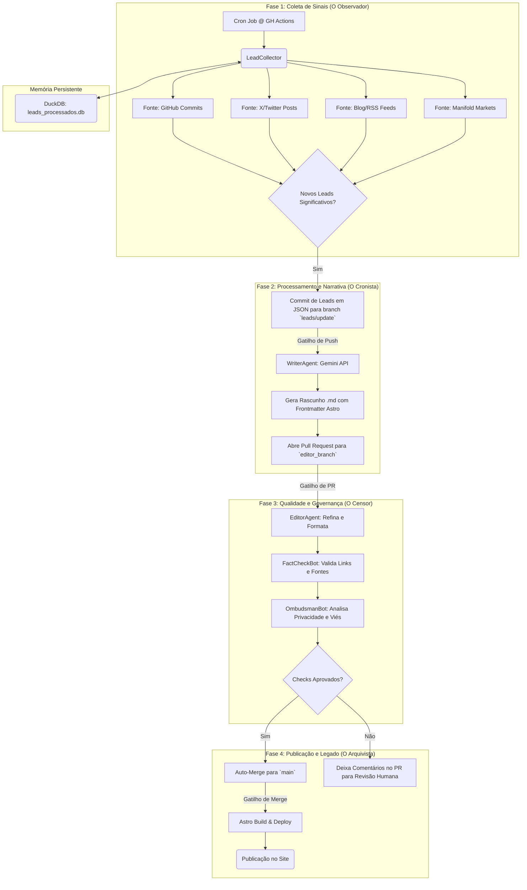

# **Documento Conceitual: A Crônica de Franklin Baldo**
## _Um Blueprint para um Jornal Autobiográfico Potencializado por IA_

**Versão:** 1.0
**Autor:** (Sistema de IA, a pedido de Franklin Baldo)
**Data:** 26 de Maio de 2024

### **Resumo Executivo**

Este documento delineia a visão, arquitetura e filosofia por trás da "Crônica de Franklin Baldo", um sistema de software projetado para funcionar como um jornalista e arquivista pessoal automatizado. O objetivo é transformar o fluxo de atividades públicas digitais de Franklin Baldo em uma narrativa coesa, contextualizada e pesquisável, publicada como um blog no repositório `franklinbaldo/mind-fragments`.

O sistema irá monitorar fontes de dados públicas (GitHub, X/Twitter, blogs, Manifold Markets), identificar eventos significativos ("leads"), e usar uma cadeia de agentes de Inteligência Artificial (inicialmente potencializados pela API Gemini do Google) para redigir, editar e verificar artigos. O processo inteiro é orquestrado via GitHub Actions, tratando a criação de conteúdo como um pipeline de CI/CD (Integração Contínua/Entrega Contínua), onde cada etapa representa um gate de qualidade.

A longo prazo, este projeto não é apenas sobre automação de conteúdo, mas sobre a criação de um legado digital vivo: um registro dinâmico e interativo da evolução intelectual, profissional e especulativa de um indivíduo. É um experimento em autoquantificação narrativa, projetado para ser útil não apenas para leitores humanos, mas como um dataset de treinamento único para futuras IAs.

---

### **1. Filosofia e Princípios Orientadores**

A Crônica será construída sobre quatro pilares fundamentais:

1.  **Flexibilidade de Modelo, Pragmatismo na Execução:** Começaremos com a API Gemini do Google (ex: Gemini 1.5 Pro) para garantir resultados de alta qualidade com o mínimo de sobrecarga de infraestrutura. No entanto, a arquitetura será modular, com um "serviço de cliente LLM" abstrato, permitindo a substituição futura por modelos open-weights (como Llama ou Mixtral) ou outras APIs (Anthropic, OpenAI) sem reescrever a lógica de negócio dos agentes. A escolha do modelo deve ser uma decisão tática, não um dogma.

2.  **Autonomia Supervisionada via Pipeline de Qualidade:** O sistema não terá permissão para publicar diretamente. A autonomia é canalizada através de um rigoroso pipeline Git-nativo. Um "lead" torna-se um post apenas após passar por múltiplos gates automatizados e, quando necessário, por uma revisão humana. O lema é: "Automatizar o rascunho, garantir a qualidade".

3.  **O Repositório Git como Fonte da Verdade:** Todo o estado do sistema – desde leads brutos até rascunhos, revisões e artigos publicados – viverá dentro do repositório Git. Branches representam estágios de trabalho, Pull Requests (PRs) são os artefatos de revisão, e o merge para o branch `main` é o ato final de publicação. Isso garante transparência, rastreabilidade e a capacidade de reverter qualquer ação.

4.  **Verdade Pública, Prudência na Publicação:** O sistema só coletará dados que já são públicos. A preocupação com a privacidade (PII - Informações de Identificação Pessoal) não reside na coleta, mas na **síntese**. O verdadeiro risco é a IA conectar pontos de dados públicos de uma maneira que crie uma violação de privacidade contextual (doxxing-by-inference). Portanto, um agente "Ombudsman" final é um gate de segurança crítico para garantir que os artigos gerados não violem a privacidade de Franklin, sua família ou amigos, mesmo que as fontes sejam públicas.

---

### **2. Visão Arquitetural: O Boswell Digital**

Inspirado em James Boswell, o biógrafo de Samuel Johnson, nosso sistema funcionará como um "Boswell Digital" – um observador diligente que registra, contextualiza e narra. O fluxo de trabalho é o seguinte:

---

### **3. O Elenco de Agentes: Uma Equipe de Especialistas Digitais**

Cada etapa do pipeline é executada por um agente especializado, que é essencialmente um script Python envolvendo um prompt bem definido para a API do Gemini.

| Agente | Persona | Responsabilidade Principal |
| :--- | :--- | :--- |
| **LeadCollector** | O Arquivista | Monitora as fontes de dados, identifica novos eventos e os normaliza em um formato de "lead" (JSON). Não usa LLM. |
| **WriterAgent** | O Ghostwriter | Recebe um lead estruturado e o transforma em um rascunho de artigo coeso, em primeira ou terceira pessoa, seguindo um estilo predefinido. Gera o frontmatter completo. |
| **EditorAgent** | O Editor Cético | Revisa o rascunho do WriterAgent em busca de clareza, concisão e aderência ao guia de estilo. Corrige gramática, formata o markdown e pode rejeitar rascunhos de baixa qualidade. |
| **FactCheckBot** | O Verificador | Extrai todas as URLs e alegações factuais do texto. Verifica se os links estão ativos e, crucialmente, usa a janela de contexto do Gemini para "ler" o conteúdo do link e confirmar se ele suporta a afirmação feita no artigo. |
| **OmbudsmanBot** | O Guardião da Ética | A etapa final de segurança. Analisa o artigo editado para detectar potenciais riscos de privacidade, correlações indesejadas, viés excessivo ou tom difamatório. É a consciência do sistema. |

---

### **4. A Pilha Tecnológica: Pragmatismo Acima de Dogma**

*   **LLM:** **Google Gemini API (inicialmente)**. Escolhido pela alta capacidade (janela de contexto gigante do 1.5 Pro é ideal para o FactCheckBot), baixa latência e infraestrutura gerenciada.
*   **Orquestração:** **GitHub Actions**. Gratuito para projetos públicos, nativo do ecossistema de desenvolvimento e perfeito para o modelo de pipeline baseado em Git.
*   **Armazenamento de Dados:** **DuckDB**. Um banco de dados em arquivo, perfeito para ser usado dentro do workflow do GitHub Actions. Armazenará os IDs dos leads já processados para evitar duplicidade.
*   **Frontend:** **Astro (AstroPaper)**. Já existente no repositório, conhecido por sua performance e excelente experiência de desenvolvimento para sites de conteúdo.

---

### **5. Uma Visão para o Futuro: A Evolução da Crônica**

Este projeto não termina quando o primeiro post for publicado. Sua verdadeira força emergirá com o tempo, à medida que o volume de dados cresce.

#### **Horizonte 1 (Ano 1-2): A Crônica Amadurece**

*   **Resultado Esperado:** O sistema atinge um estado de "confiabilidade supervisionada". A maioria dos leads de fontes primárias (GitHub, seu blog) são processados automaticamente, exigindo apenas uma rápida aprovação humana no PR. O blog é atualizado quase em tempo real com suas atividades públicas.
*   **Hipóteses:**
    *   **Voz Narrativa Consistente:** Após meses de ajuste de prompt e exemplos, o `WriterAgent` e o `EditorAgent` convergirão para uma voz editorial que é indistinguível da sua própria escrita para posts factuais.
    *   **Expansão de Fontes:** O sistema será expandido para incluir fontes mais complexas, como discussões no X/Twitter ou a resolução de mercados no Manifold, exigindo que os agentes aprendam a sintetizar múltiplos pontos de dados em uma única narrativa.
    *   **Feedback Loop:** Os artigos publicados (e suas métricas de engajamento, se disponíveis) podem se tornar um novo input para o sistema, que poderia aprender quais tipos de posts são mais "interessantes".

#### **Horizonte 2 (Ano 2-4): Inteligência Emergente e Síntese**

*   **Resultado Esperado:** O banco de dados de artigos se torna grande o suficiente para que o sistema mude de um simples "cronista" para um "analista". Novos agentes podem ser introduzidos para tarefas de síntese.
*   **Hipóteses:**
    *   **Geração de Posts "On This Day":** O sistema pode gerar automaticamente posts do tipo "Há 3 anos, Franklin estava explorando este conceito..." correlacionando artigos antigos com atividades atuais.
    *   **Detecção de Evolução de Pensamento:** Um agente analítico poderia, trimestralmente, analisar todos os posts sobre um determinado tópico (ex: "Inteligência Artificial") e redigir um meta-artigo intitulado "Uma Análise da Minha Posição em IA: Evolução de Q1 2025 a Q1 2026", destacando mudanças de opinião e contradições.
    *   **Identificação de Conexões Inexploradas:** O sistema poderia identificar que um commit em um projeto de física quântica e uma aposta no Manifold sobre leis de conservação ocorreram na mesma semana e sugerir um post mais profundo conectando os dois eventos, algo que você mesmo poderia não ter notado. O prompt se tornaria: "Analise os leads da última semana e proponha uma tese original que os conecte."

#### **Horizonte 3 (Ano 5+): O Oráculo Pessoal e a Máquina de Legado**

*   **Resultado Esperado:** O sistema transcende um blog. Torna-se um "gêmeo digital" de sua persona pública, um banco de dados semântico de sua vida intelectual.
*   **Hipóteses:**
    *   **Interface de Query em Linguagem Natural:** O blog ganha uma barra de busca potencializada por LLM que permite queries complexas. Em vez de buscar por palavras-chave, você poderia perguntar: "Qual era minha maior preocupação sobre desalinhamento de IA em 2027 e quais projetos práticos eu estava codificando para mitigá-la?". O sistema sintetizaria uma resposta a partir de múltiplos posts e commits.
    *   **Fine-tuning de um "Franklin-bot":** O corpus inteiro de artigos, revisados e factualmente corretos, se torna o dataset de fine-tuning perfeito para um modelo de linguagem menor. O resultado seria um chatbot capaz de responder a perguntas "no estilo de Franklin", baseado em seu histórico de pensamentos e ações documentadas.
    *   **Geração de Legado Ativo:** Em um cenário de longo prazo, o sistema poderia ser instruído a continuar operando autonomamente, mantendo o registro de seu legado digital (projetos open-source, escritos) vivo e contextualizado para futuras gerações ou pesquisadores. Ele poderia até mesmo "defender" suas ideias passadas, citando as fontes originais.

---

### **6. Governança, Ética e o "Interruptor de Emergência"**

A automação em larga escala exige responsabilidade.

*   **O Interruptor:** A qualquer momento, as GitHub Actions podem ser desativadas, pausando todo o pipeline.
*   **O Processo de Apelação:** Qualquer pessoa (incluindo o próprio Franklin) deve poder abrir uma Issue no repositório com o título "Takedown Request" para um artigo específico. Isso deve acionar um workflow que automaticamente reverte o post para o estado de "rascunho", tirando-o do ar até que a revisão seja concluída.
*   **A Responsabilidade Final:** O proprietário do repositório, Franklin Baldo, é o editor-chefe final. A automação é uma ferramenta para aumentar sua capacidade, não para absolvê-lo da responsabilidade pelo conteúdo publicado. O OmbudsmanBot é uma salvaguarda, mas o julgamento humano final, especialmente em casos limítrofes, é insubstituível.

---

### **Conclusão**

A Crônica de Franklin Baldo é mais do que um blog automatizado. É uma aposta na ideia de que a intersecção de LLMs, engenharia de software disciplinada e um fluxo constante de dados pessoais públicos pode criar algo novo: um espelho dinâmico da jornada intelectual de uma pessoa. Começamos com um objetivo pragmático – documentar o presente – mas com a visão de construir uma ferramenta poderosa para entender o passado e interrogar o futuro.
